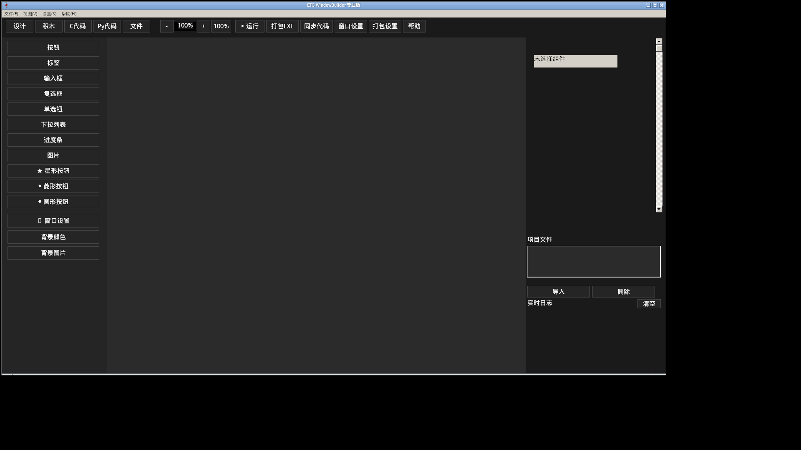

# ETC WindowBuilder 专业版

> 一款用 **C 语言 / Win32 / GDI+** 从零实现的可视化 GUI 构建器，面向所有技术人员的学习与开发软件。

开发者：**ET**　公司：**ET Studio**　测试：小态度轩, 威龙
版权：**(c) ET 2024-2026**　版本：**12.0**

---

## 下载安装（装完即用，无需另装任何编译器）

- 完整离线安装包（内置 MinGW GCC + Python 3 + OpenJDK 17，约 1.1GB）：
  **[ETCWindowBuilder-Setup-v12.0.exe](https://github.com/ETQWFD/ETC-WindowBuilder/releases/download/v12.0/ETCWindowBuilder-Setup-v12.0.exe)**
- 绿色版主程序（不含内置工具链）：
  **[ETC-WindowBuilder.exe](https://github.com/ETQWFD/ETC-WindowBuilder/releases/download/v12.0/ETC-WindowBuilder.exe)**
- 全部版本见 [Releases](https://github.com/ETQWFD/ETC-WindowBuilder/releases)。支持 Windows 7/10/11 x64；Linux 下可用 Wine 运行。



---

## 特性

- **可视化 UI 窗口设计**：在画布上拖放按钮、标签、输入框、复选框、单选钮、下拉列表、进度条、图像，以及星形 / 菱形 / 圆形特殊形状。
- **积木式编程**：无需记忆语法，双击积木即可为「窗口启动」「按钮被点击」「窗口关闭」等事件组装动作（弹消息、打开文件 / 网址、设置文本、退出、延时、变量赋值与判断循环等）。
- **三向实时同步**：设计画布、C 代码、Python 代码任意一处修改，其余两处自动更新。
- **双语言代码生成**：
  - C（原生 Win32，可直接用内置 MinGW-w64 GCC 编译为独立 EXE）；
  - Python（tkinter，用内置 Python 直接运行）。
- **Java 支持**：文件模式可直接编译运行 `.java`（内置 JDK 17）。
- **ET 引擎加密工程文件**：`.nep` 项目采用 PBKDF2-SHA256 + ChaCha20 加密保存，可设密码。
- **一键打包**：项目可编译为带 ET 版本资源与图标的 EXE，并可生成 NSIS 安装程序。
- **内置完整工具链，装完即用**：安装包自带
  - `runtime\mingw64` —— MinGW-w64 GCC 14.2（C/C++ 编译器）
  - `runtime\python` —— Python 3.11（含 tkinter）
  - `runtime\jdk` —— OpenJDK 17（javac / java）
  无需另行安装、配置 PATH，绿色便携。

## 目录

```
ETCWindowBuilder/
├─ ETC-WindowBuilder.exe      主程序
├─ runtime/                   内置语言运行时与编译器
│  ├─ mingw64/
│  ├─ python/
│  └─ jdk/
├─ docs/tutorials/            学习教程
└─ assets/
```

## 快速开始

1. 运行安装包 `ETCWindowBuilder-Setup-v12.0.exe`（或直接运行绿色版 EXE）。
2. 左侧「设计」页点击工具箱添加组件，在中间画布拖拽定位，右侧面板修改属性。
3. 切换「积木」页为按钮添加点击逻辑。
4. 点顶部 **运行**：在 C 代码页编译运行 C 程序；在 Py 代码页运行 Python 程序。
5. 「文件」页可直接编译运行磁盘上的 `.c` / `.py` / `.java` 文件。
6. 用「文件 → 保存项目」把工程保存为加密 `.nep`。

详见 `docs/tutorials/`：
- `01-快速入门.md`
- `02-可视化设计.md`
- `03-积木编程.md`
- `04-C语言开发.md`
- `05-Python开发.md`
- `06-Java开发.md`
- `07-加密项目与打包.md`
- `08-内置工具链说明.md`

## 从源码构建

主程序为纯 C（Win32 + GDI+），用 MinGW-w64 交叉编译或在 MSYS2/MinGW64 下编译：

```bash
# 依赖（Ubuntu 交叉编译示例）
sudo apt install -y gcc-mingw-w64-x86-64 nsis

# 编译资源与主程序（在 src/ 目录）
x86_64-w64-mingw32-windres builder.rc -O coff -o builder.o
x86_64-w64-mingw32-gcc -O2 -mwindows -finput-charset=UTF-8 \
  etb_main.c etb_ui.c etb_ui2.c etb_gen.c etb_blocks.c etb_crypto.c etb_save.c builder.o \
  -o ../release/ETC-WindowBuilder.exe \
  -lgdi32 -lcomctl32 -lgdiplus -lshell32 -lshlwapi -lole32 -luuid -lcomdlg32 -static

# 制作离线安装包（需先把 mingw64/python/jdk 放入项目根 runtime/）
cd installer && makensis ETCWindowBuilder.nsi
```

## 版权与许可

本软件版权归 **ET / ET Studio** 所有，可自由用于学习与个人开发，禁止未经授权的商业再分发。
内置第三方运行时遵循各自开源许可（MinGW-w64 / GCC、CPython、Eclipse Temurin/OpenJDK），许可文本见 `runtime` 各目录。
